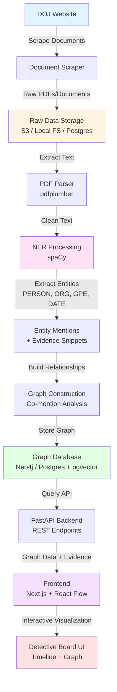

# 🕵️ Sherlock Combs — Document Entity Graph Explorer

A hackathon-built AI-powered document analysis tool that transforms messy document dumps into an interactive detective-style investigation board.

Upload documents → extract people/places/organizations → build evidence-backed connections → explore them through a timeline-driven graph interface.

---

## 🛠️ Setup & Installation

### Prerequisites
- Python 3.8+
- pip

### Quick Start

1. **Create and activate a virtual environment** (recommended):
   ```bash
   # Create virtual environment
   python3 -m venv venv
   
   # Activate it
   # On macOS/Linux:
   source venv/bin/activate
   # On Windows:
   # venv\Scripts\activate
   ```

2. **Install dependencies**:
   ```bash
   pip install -r requirements.txt
   ```

3. **Set up OpenAI API key** (see section below)

4. **Test the PDF parser**:
   ```bash
   # With OpenAI (default, requires API key):
   python scripts/parse_pdf.py sample_data/EFTA00011414.pdf -o output.json
   
   # Without LLM (simple extraction only):
   python scripts/parse_pdf.py sample_data/EFTA00011414.pdf -o output.json --no-llm
   ```

### OpenAI API Setup (Required for LLM Summarization)

The PDF parser uses OpenAI's API for generating summaries and extracting dates. To use this feature:

1. **Get an OpenAI API key**:
   - Sign up at https://platform.openai.com/
   - Create an API key in your account settings

2. **Set the API key as an environment variable**:
   ```bash
   # macOS/Linux:
   export OPENAI_API_KEY="sk-your-key-here"
   
   # Windows (PowerShell):
   $env:OPENAI_API_KEY="sk-your-key-here"
   
   # Or add to your ~/.zshrc or ~/.bashrc for persistence:
   echo 'export OPENAI_API_KEY="sk-your-key-here"' >> ~/.zshrc
   ```

3. **Test the parser with OpenAI**:
   ```bash
   python scripts/parse_pdf.py sample_data/EFTA00011414.pdf -o output.json
   ```

   The script will automatically use OpenAI if `OPENAI_API_KEY` is set. By default, it uses `gpt-4o-mini` for cost efficiency.

### Frontend Setup

The frontend is a Next.js application located in the `frontend/` directory.

1. **Navigate to the frontend directory**:
   ```bash
   cd frontend
   ```

2. **Install dependencies**:
   ```bash
   npm install
   ```

3. **Run the development server**:
   ```bash
   npm run dev
   ```

4. **Open your browser**:
   Navigate to [http://localhost:3000](http://localhost:3000)

The frontend will automatically read `output.json` from the project root after you've parsed some PDFs.

### Development Setup

**Backend:**
- `pdfplumber` for PDF text extraction
- `python-dateutil` for date parsing
- `openai` for LLM-powered summarization and date extraction
- `transformers` and `torch` (optional, for local models)

**Frontend:**
- Next.js 14 with TypeScript
- React Flow for graph visualization
- Tailwind CSS for styling

---

## 🚀 Inspiration

Large investigative datasets (court filings, logs, reports, leaked archives, etc.) are difficult to navigate manually.

We wanted to build a system that helps users answer questions like:
- Who appears most often across documents?
- Which people are mentioned together?
- How do relationships change over time?
- What connections emerge when you zoom into a specific date range?

Inspired by investigative link analysis tools, we created a lightweight MVP in 24 hours.

---

## 🎯 What It Does

This project takes in a collection of documents and automatically:

### ✅ Extracts key entities:
- People
- Organizations
- Locations
- Dates

### ✅ Builds a graph of relationships based on evidence:
- Entities mentioned in the same sentence are connected
- Each edge is backed by a source citation snippet

### ✅ Provides an interactive UI:
- Timeline scrubber filters connections over time
- Detective board graph updates dynamically
- Clicking an edge reveals the exact evidence text
- Clicking a node shows all mentions across documents

---

## 🧠 How It Works

### 1. Document Ingestion

Documents are uploaded and converted into clean text.
- PDFs are parsed using lightweight extraction tools
- Each document is assigned a timestamp (from metadata or filename)

### 2. Named Entity Recognition (NER)

We run NLP-based entity extraction using spaCy:
- `PERSON`
- `ORG`
- `GPE` (locations)
- `DATE`

Each entity mention is stored with:
- Document ID
- Page number
- Exact text snippet
- Timestamp

### 3. Evidence-Backed Graph Construction

Instead of guessing intent, we build only safe, source-grounded links:
- If two entities appear in the same sentence → connect them
- Edge weight increases with repeated co-occurrence
- Every edge stores the best supporting snippets

This produces an investigation graph like:

```
Person A ── mentioned_with ── Person B
(evidence sentence attached)
```

### 4. Timeline-Sliced Detective Board

The key feature is time-based navigation:
- User selects a date window
- Graph updates to show only nodes/edges active in that period
- Relationships evolve as the timeline moves

---

## 📐 Architecture & Data Flow



---

## 📋 Data Schemas by Stage

### 1. Raw Data Storage (After Scraping)

```json
{
  "doc_id": "doc_000123",
  "source_type": "pdf|email|image|web",
  "source_uri": "s3://bucket/000123.pdf",
  "scraped_at": "2024-01-15T10:30:00Z",
  "metadata": {
    "title": "Document Title",
    "date": "2004-04-12",
    "author": null,
    "url": "https://www.justice.gov/...",
    "file_size": 245678,
    "mime_type": "application/pdf"
  },
  "raw_content": "<binary or raw text>"
}
```

### 2. NER Input (After PDF Parser)

```json
{
  "doc_id": "doc_000123",
  "source_type": "pdf|email|image|web",
  "source_uri": "s3://bucket/000123.pdf",
  "page_id": "doc_000123#p04",
  "text": "On April 12, 2004, John Doe met Jane Smith in Palm Beach...",
  "page_number": 4,
  "extracted_at": "2024-01-15T10:35:00Z",
  "document_timestamp": "2004-04-12T00:00:00Z"
}
```

### 3. NER Output (Extracted Entities)

```json
{
  "doc_id": "doc_000123",
  "page_id": "doc_000123#p04",
  "entities": [
    {
      "entity_id": "ent_001",
      "text": "John Doe",
      "type": "PERSON",
      "start_char": 20,
      "end_char": 28,
      "confidence": 0.95,
      "sentence": "On April 12, 2004, John Doe met Jane Smith in Palm Beach.",
      "sentence_start": 0,
      "sentence_end": 65
    },
    {
      "entity_id": "ent_002",
      "text": "Jane Smith",
      "type": "PERSON",
      "start_char": 33,
      "end_char": 43,
      "confidence": 0.94,
      "sentence": "On April 12, 2004, John Doe met Jane Smith in Palm Beach.",
      "sentence_start": 0,
      "sentence_end": 65
    },
    {
      "entity_id": "ent_003",
      "text": "Palm Beach",
      "type": "GPE",
      "start_char": 47,
      "end_char": 57,
      "confidence": 0.92,
      "sentence": "On April 12, 2004, John Doe met Jane Smith in Palm Beach.",
      "sentence_start": 0,
      "sentence_end": 65
    },
    {
      "entity_id": "ent_004",
      "text": "April 12, 2004",
      "type": "DATE",
      "start_char": 3,
      "end_char": 17,
      "confidence": 0.98,
      "normalized_date": "2004-04-12",
      "sentence": "On April 12, 2004, John Doe met Jane Smith in Palm Beach.",
      "sentence_start": 0,
      "sentence_end": 65
    }
  ],
  "processed_at": "2024-01-15T10:36:00Z"
}
```

### 4. Graph Database Schema

#### Nodes (Entities)
```json
{
  "id": "ent_001",
  "name": "John Doe",
  "type": "PERSON",
  "canonical_id": "person_john_doe_001",
  "first_seen": "2004-04-12T00:00:00Z",
  "last_seen": "2004-08-15T00:00:00Z",
  "mention_count": 47,
  "documents": ["doc_000123", "doc_000456"],
  "aliases": ["J. Doe", "John D."]
}
```

#### Edges (Relationships)
```json
{
  "edge_id": "edge_001",
  "src_entity_id": "ent_001",
  "dst_entity_id": "ent_002",
  "relationship_type": "mentioned_with",
  "weight": 12,
  "first_seen": "2004-04-12T00:00:00Z",
  "last_seen": "2004-08-15T00:00:00Z",
  "evidence": [
    {
      "doc_id": "doc_000123",
      "page_id": "doc_000123#p04",
      "snippet": "On April 12, 2004, John Doe met Jane Smith in Palm Beach.",
      "timestamp": "2004-04-12T00:00:00Z",
      "sentence_start": 0,
      "sentence_end": 65
    },
    {
      "doc_id": "doc_000456",
      "page_id": "doc_000456#p12",
      "snippet": "John Doe and Jane Smith attended the meeting together.",
      "timestamp": "2004-05-20T00:00:00Z",
      "sentence_start": 0,
      "sentence_end": 52
    }
  ],
  "evidence_count": 12
}
```

### 5. API Response (Frontend)

#### Graph Query Response
```json
{
  "nodes": [
    {
      "id": "ent_001",
      "label": "John Doe",
      "type": "PERSON",
      "data": {
        "mention_count": 47,
        "first_seen": "2004-04-12T00:00:00Z",
        "last_seen": "2004-08-15T00:00:00Z",
        "documents": ["doc_000123", "doc_000456"]
      }
    },
    {
      "id": "ent_002",
      "label": "Jane Smith",
      "type": "PERSON",
      "data": {
        "mention_count": 32,
        "first_seen": "2004-04-12T00:00:00Z",
        "last_seen": "2004-07-10T00:00:00Z",
        "documents": ["doc_000123", "doc_000789"]
      }
    }
  ],
  "edges": [
    {
      "id": "edge_001",
      "source": "ent_001",
      "target": "ent_002",
      "label": "mentioned_with",
      "weight": 12,
      "data": {
        "evidence_count": 12,
        "first_seen": "2004-04-12T00:00:00Z",
        "last_seen": "2004-08-15T00:00:00Z"
      }
    }
  ],
  "timeline_range": {
    "start": "2004-04-12T00:00:00Z",
    "end": "2004-08-15T00:00:00Z"
  },
  "filter_applied": {
    "date_start": "2004-04-01T00:00:00Z",
    "date_end": "2004-06-30T00:00:00Z"
  }
}
```

#### Evidence Detail Response
```json
{
  "edge_id": "edge_001",
  "src_entity": {
    "id": "ent_001",
    "name": "John Doe",
    "type": "PERSON"
  },
  "dst_entity": {
    "id": "ent_002",
    "name": "Jane Smith",
    "type": "PERSON"
  },
  "evidence": [
    {
      "doc_id": "doc_000123",
      "page_id": "doc_000123#p04",
      "page_number": 4,
      "snippet": "On April 12, 2004, John Doe met Jane Smith in Palm Beach.",
      "timestamp": "2004-04-12T00:00:00Z",
      "source_uri": "s3://bucket/000123.pdf",
      "context_before": "...previous sentence...",
      "context_after": "...next sentence..."
    }
  ],
  "total_evidence_count": 12
}
```

---

## 🖥️ Tech Stack

### Backend
- **FastAPI** — REST API for graph queries
- **Python** — NLP + data processing
- **spaCy** — Named Entity Recognition
- **pdfplumber** — PDF text extraction
- **SQLite/Postgres** — storage for entities + edges

### Frontend
- **Next.js + React**
- **React Flow / Cytoscape.js** — interactive graph visualization
- Timeline slider + evidence side panel

---

## 📊 Core Data Model

### Entities (Nodes)
- `id`
- `name`
- `type`
- `first_seen`, `last_seen`

### Mentions (Evidence Anchors)
- `doc_id`
- `page`
- `snippet`
- `timestamp`

### Edges (Connections)
- `src_entity_id`
- `dst_entity_id`
- `weight`
- `evidence[]`

---

## 🏆 Hackathon MVP Features
- Upload documents
- Entity extraction
- Co-mention relationship graph
- Timeline filtering
- Clickable evidence panel
- Investigation-board visualization

---

## ⚠️ Responsible Design

This tool is designed as a document navigation + evidence explorer, not an accusation engine.

Key safeguards:
- Connections represent only textual co-occurrence
- Every link is backed by an explicit citation snippet
- No suspicion scoring or automated conclusions

**Appearance in a document ≠ wrongdoing.**

---

## 🌟 Future Improvements
- Event extraction (meetings, flights, filings)
- Entity resolution + alias merging
- Semantic relationship extraction beyond co-mentions
- Scalable graph search (Neo4j / pgvector)
- Better support for OCR-scanned documents
- Collaboration + investigation workspaces

---

## 🏁 Demo Flow
1. Upload a document pack
2. Entities are extracted automatically
3. Timeline scrub filters the investigation board
4. Click edges → view evidence
5. Explore evolving connections over time

---

## 👥 Team

Built in 24 hours as a hackathon project to explore:
- NLP + entity extraction
- Graph-based document intelligence
- Timeline-driven investigation UX

---

## 📜 License

MIT License — feel free to build on top of this project.

---

**✨ Turning unstructured documents into structured investigations.**
